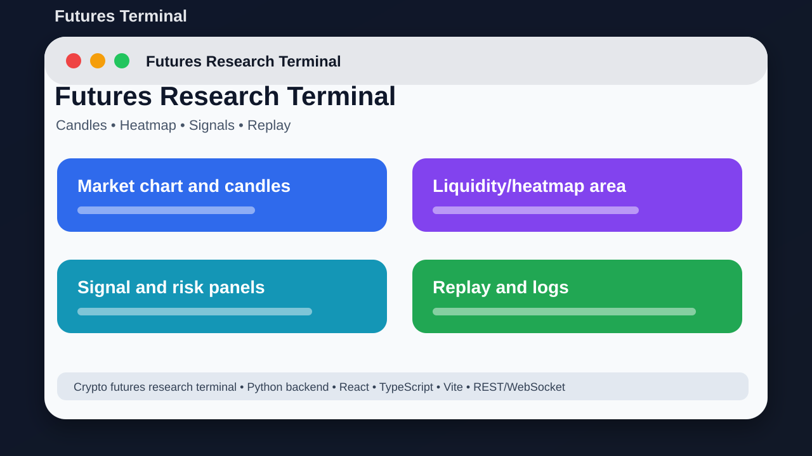

# Futures Terminal



## Short Description

A local crypto futures dashboard for market research, signals, replay, and analysis.

## About This Project

Futures Terminal is a full-stack trading research terminal. It has a Python backend and a React/TypeScript frontend for market data, signal views, replay screens, and trading-tool experiments.

The goal is to keep the project easy to understand, easy to run, and useful for learning or further development.

## Main Features

- Trading-style dashboard UI
- Market data service structure
- Heatmap, candles, signal, and order panels
- Replay and logging pages
- Configurable symbols and risk settings
- Backend/frontend development scripts

## Tech Stack

- Python backend
- React
- TypeScript
- Vite
- REST/WebSocket

## Project Location

Main local folder:

```text
D:\PROJECTS\FuturesTerminal\futures-terminal
```

GitHub repository:

https://github.com/saifalian/FuturesTerminal

## Project Structure

```text
futures-terminal/
backend/       Python backend services
frontend/      React/TypeScript frontend
config/        Symbols, risk, and app settings
docs/          Extra documentation
scripts/       Setup and run scripts
```

## How To Run

1. Go into futures-terminal.
2. Install Python requirements.
3. Go into frontend and run npm install.
4. Start backend and frontend using the scripts in scripts/.
5. Open the local dashboard in your browser.

## Screenshot

The image above is a clean project preview for GitHub. It shows the main idea of the project in a simple way.

## Current Status

This project is uploaded to GitHub and prepared as a portfolio-style repository. More improvements can be added later, such as real app screenshots, demo videos, releases, and issue templates.

## Safety Note

This is a research project, not financial advice. Do not connect real funds without deep testing.

## License

No license file is included yet. Add a license before using this project as an open-source project.
